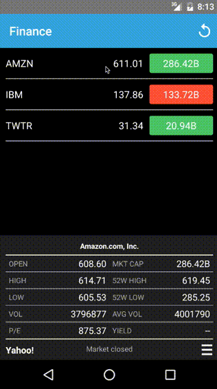

# FinanceReactNative

 

iOS's Stocks App clone written in [React Native](https://github.com/facebook/react-native) for demo purpose (available both iOS and Android). Data is pulled from [Yahoo Finance](finance.yahoo.com).

## Demo

* Rejected by Apple reviewer :smile:: "Your app is too similar to App Stock app, which creates a misleading association with Apple products."

## App preview

## Screenshots

 

## React and React Native version

* [react](https://github.com/facebook/react): 15.0.2
* [react-native](https://github.com/facebook/react-native): 0.26.3

## Plugins used

* [alt](https://github.com/goatslacker/alt) - Isomorphic flux implementation.
* [react-native-navbar](https://github.com/Kureev/react-native-navbar) - Navbar component for React Native.
* [react-native-router-flux](https://github.com/aksonov/react-native-router-flux) - React Native Router based on new React Native Navigation API (0.26)
* [react-native-simple-store](https://github.com/jasonmerino/react-native-simple-store) - A minimalistic wrapper around React Native's AsyncStorage.
* [react-native-vector-icons](https://github.com/oblador/react-native-vector-icons) - 3000 Customizable Icons for React Native with support for NavBar/TabBar/ToolbarAndroid, image source and full stying.
* [rn-viewpager](https://github.com/zbtang/React-Native-ViewPager) - ViewPager and Indicator component for react-native on both android and ios.

## Components used

* **AppRegistry** - The JS entry point to running all React Native apps.
* **Image** - A React component for displaying different types of images, including network images, static resources, temporary local images, and images from local disk, such as the camera roll.
* **Linking** - A general interface to interact with both incoming and outgoing app links.
* **ListView** - A core component designed for efficient display of vertically scrolling lists of changing data.
* **Platform** - A module is provided by React Native to detect what is the platform in which the app is running.
* **RefreshControl** - This component is used inside a ScrollView or ListView to add pull to refresh functionality.
* **StatusBar** - Component to control the app status bar.
* **StyleSheet** - A StyleSheet is an abstraction similar to CSS StyleSheets.
* **Text** - A React component for displaying text which supports nesting, styling, and touch handling.
* **TextInput** - A foundational component for inputting text into the app via a keyboard.
* **ToolbarAndroid** - React component that wraps the Android-only Toolbar widget.
* **TouchableHighlight** - A wrapper for making views respond properly to touches.
* **View** - The most fundamental component for building UI, View is a container that supports layout with flexbox, style, some touch handling, and accessibility controls, and is designed to be nested inside other views and to have 0 to many children of any type.

## Additional

* [eslint](https://github.com/eslint/eslint): A fully pluggable tool for identifying and reporting on patterns in JavaScript.

## Running

#### Clone & install

* Clone this repo `git clone git@github.com:7kfpun/FinanceReactNative.git`
* `cd FinanceReactNative`
* run `npm install`

#### iOS

* Run `react-native run-ios`

#### Android

* Run `android avd` and start an emulator
* Run `react-native run-android`

## License

Released under the [MIT License](http://opensource.org/licenses/MIT).
